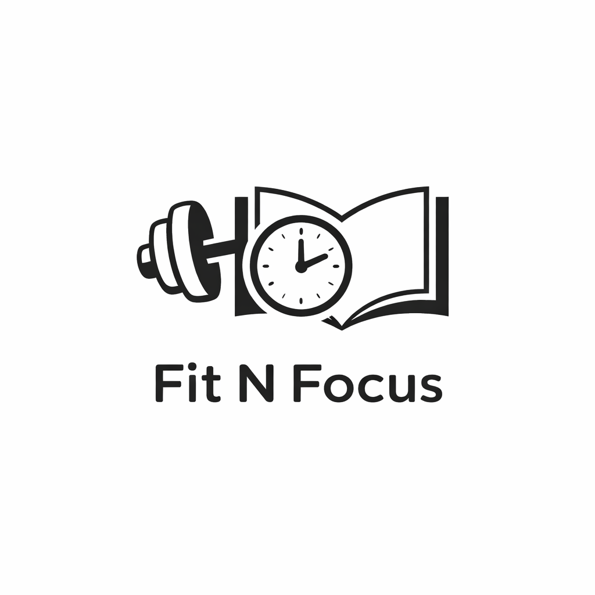

# FitNFocus

<p align="center">
  
</p>

<p align="center">
  
  
  
  
</p>

FitNFocus is an Android study and focus tracking app.

The app helps users organize learning goals, plan study sessions and track their progress.

The repository is published as a portfolio project to demonstrate my Android development work.

It was developed as a university project for the Mobile Application Development course.


## Features

* Learning goals and topics
* Study session planning
* Focus timer
* Progress tracking
* Local data storage
* Onboarding and user preferences
* Animated UI elements

## Tech Stack

**Kotlin · Jetpack Compose · Material 3 · Room · DataStore · Navigation Compose · MVVM**

The application stores its data locally on the device.

## Run the Project

1. Clone the repository.

```bash
git clone https://github.com/eugeniaFan/FitNFocus-Android-App.git
```

2. Open the `FitNFocus` folder in Android Studio.

3. Let Gradle sync the project.

4. Start an emulator or connect an Android device.

5. Run the `app` configuration.

**Requirements:** Android Studio, JDK 17 and Android 8.0 or newer.

## Copyright

Copyright © 2026 Eugenia Fanenstiel. All rights reserved.

This repository is provided for viewing and evaluation purposes only. No permission is granted to copy, modify, distribute or use the source code without prior written permission.
